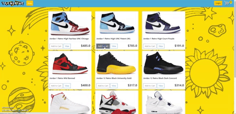

# TrendStop

TrendStop is a mock user-friendly sneaker re-selling e-store with complete functionality. This e-commerce website was created using **Django** for the backend and **HTML**, **Javascript**, and **CSS** for the frontend.

## How to Visit TrendStop
1. Visit http://iissh2.pythonanywhere.com/.
2. Add any sneakers to your cart.
3. Checkout! ~~this feature is currently disabled as I have no products in stock~~

## Notable Features
#### Add and remove items to/from the cart and change the quantity
You can add as many of a particular sneaker as you want or remove it all together. Add items from the store tab and remove them from the cart tab.  

          
#### Paypal payment integration
This feature has been disabled for the moment, it will be integrated again for the next update of the website.

#### Highly User-friendly
The website has no hidden tricks. It is super easy to navigate and has customizable features to always keep the experience fresh.
